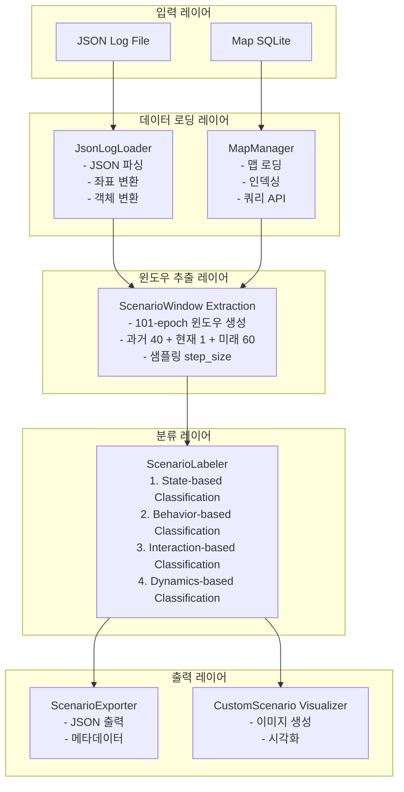
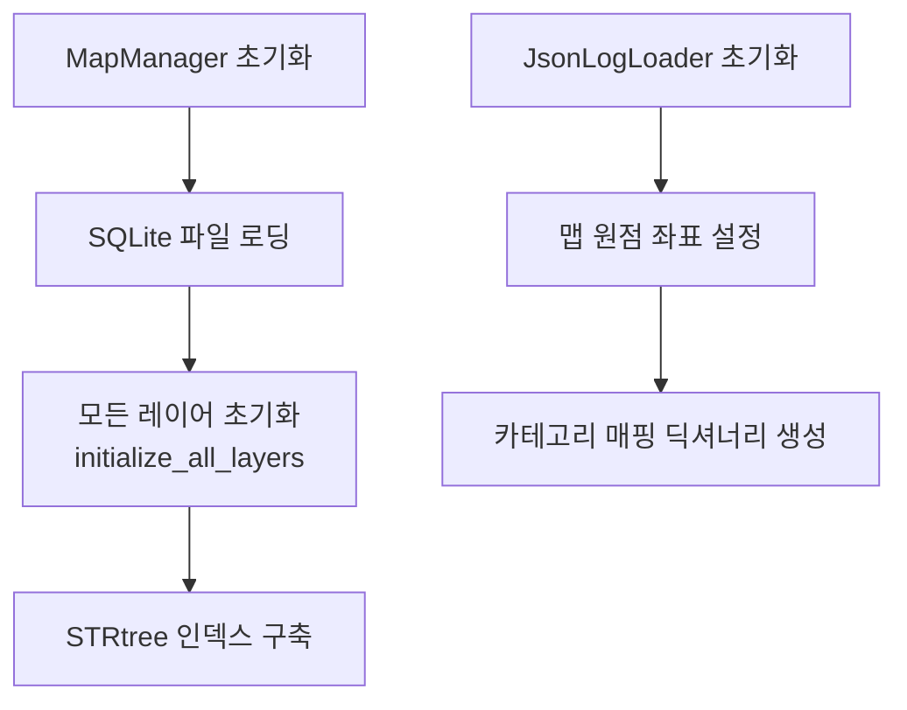
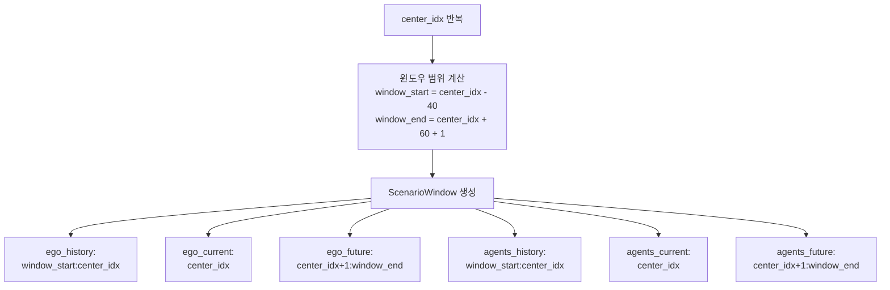
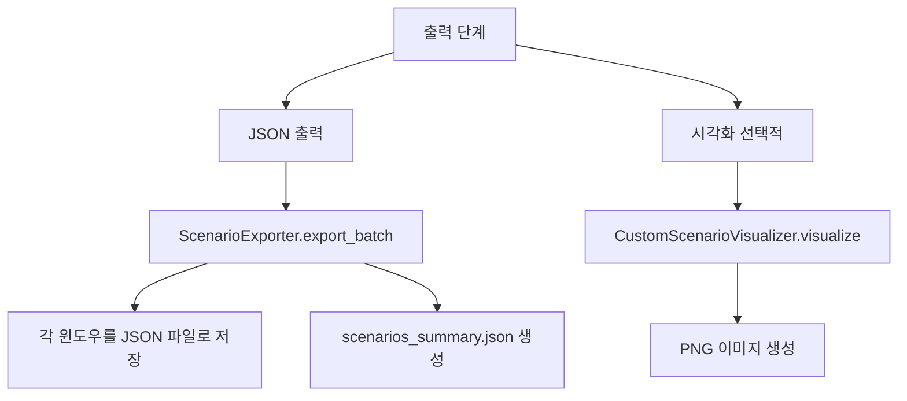
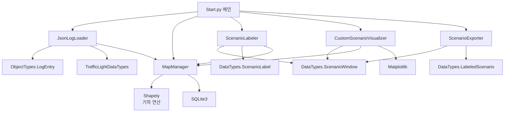

# 시스템 아키텍처

## 개요

시나리오 분류기 시스템은 자율주행 로그 데이터를 입력받아 주행 시나리오를 자동으로 분류하고 라벨링하는 파이프라인입니다. 시스템은 모듈화된 구조로 설계되어 각 컴포넌트가 명확한 역할을 담당합니다.

## 전체 시스템 구조



## 핵심 컴포넌트

### 1. JsonLogLoader

**역할**: JSON 형식의 로그 파일을 읽고 NuPlan 프레임워크의 데이터 구조로 변환

**주요 기능**:
- JSON 파일 로딩 및 파싱
- 좌표계 변환 (로컬 좌표 → 맵 원점 기준 UTM 좌표)
- EgoState 객체 생성
- TrackedObject 객체 생성 (차량, 보행자, 자전거 등)
- 신호등 상태 파싱

**입력**: JSON 로그 파일 경로
**출력**: `List[LogEntry]` - 파싱된 로그 엔트리 리스트

### 2. MapManager

**역할**: SQLite 기반 맵 데이터베이스를 관리하고 공간 쿼리를 제공

**주요 기능**:
- SQLite 맵 데이터베이스 로딩
- 다양한 맵 레이어 관리 (Lane, LaneConnector, Roadblock, StopLine, Crosswalk 등)
- STRtree 기반 공간 인덱싱
- 근접 맵 객체 쿼리
- 차선 그래프 구조 관리

**입력**: SQLite 맵 파일 경로
**출력**: 맵 쿼리 API (get_proximal_map_objects, get_nearest_lane 등)

### 3. ScenarioWindow Extraction

**역할**: 연속된 로그 엔트리에서 101-epoch 시나리오 윈도우를 추출

**윈도우 구조**:
- **과거 (History)**: 40 프레임 (2초, 20Hz 기준)
- **현재 (Current)**: 1 프레임
- **미래 (Future)**: 60 프레임 (3초, 20Hz 기준)
- **총 길이**: 101 프레임 (5.05초, 20Hz 기준)

**샘플링**:
- `step_size` 파라미터로 윈도우 간격 조절
- `step_size=1`: 모든 가능한 윈도우 생성
- `step_size=100`: 100 프레임마다 윈도우 생성

### 4. ScenarioLabeler

**역할**: 4단계 분류 파이프라인을 통해 시나리오에 라벨을 할당

**분류 단계**:
1. **State-based**: 속도, 위치, 근접 객체 기반 분류
2. **Behavior-based**: 궤적 분석 기반 행동 분류
3. **Interaction-based**: 다중 에이전트 상호작용 분류
4. **Dynamics-based**: 동역학 특성 (jerk, 가속도) 분류

자세한 내용은 [시나리오 분류기 문서](./03_scenario_labeler.md)를 참조하세요.

### 5. ScenarioExporter

**역할**: 라벨링된 시나리오를 JSON 형식으로 출력

**출력 내용**:
- 시나리오 메타데이터
- 라벨 및 신뢰도 정보
- 101-epoch 전체 관측 데이터
- 요약 파일 (scenarios_summary.json)

자세한 내용은 [데이터 출력 문서](./07_export.md)를 참조하세요.

### 6. CustomScenarioVisualizer

**역할**: 시나리오를 시각화하여 PNG 이미지로 저장

**시각화 요소**:
- Ego 중심 좌표계 변환
- 맵 요소 (차선, 횡단보도)
- 차량 궤적 (과거/미래)
- 주변 객체
- 라벨 정보 오버레이

자세한 내용은 [시각화 시스템 문서](./06_visualization.md)를 참조하세요.

## 데이터 흐름

### 1. 초기화 단계



### 2. 데이터 로딩 단계

```mermaid
flowchart TD
    A[JSON 파일 로딩] --> B[JsonLogLoader.load]
    B --> C[JsonLogLoader.get_parsed_entries]
    C --> D[각 엔트리 파싱]
    D --> E[parse_ego_state<br/>→ EgoState]
    D --> F[parse_dynamic_agent<br/>→ TrackedObject]
    D --> G[parse_traffic_light<br/>→ TrafficLightStatusData]
    E --> H[get_ego_states<br/>→ List[EgoState]]
    F --> I[get_dynamic_agents<br/>→ List[List[TrackedObject]]]
```

### 3. 윈도우 추출 단계



### 4. 분류 단계

```mermaid
flowchart TD
    A[window 반복] --> B[ScenarioLabeler.classify]
    B --> C[_classify_explicit_states<br/>→ Set[str]]
    B --> D[_classify_behaviors<br/>→ Set[str]]
    B --> E[_classify_interactions<br/>→ Set[str]]
    B --> F[_classify_dynamics<br/>→ Set[str]]
    C --> G[라벨 객체 생성<br/>ScenarioLabel]
    D --> G
    E --> G
    F --> G
    G --> H[window.labels 업데이트]
```

### 5. 출력 단계



## 모듈 간 의존성



## 101-epoch 윈도우 개념

시나리오 분류는 시간적 맥락을 고려해야 합니다. 단일 프레임만으로는 차선변경이나 회전 같은 행동을 정확히 판단하기 어렵기 때문에, 과거와 미래 정보를 포함한 윈도우를 사용합니다.

### 윈도우 구조

101-epoch 윈도우는 다음과 같이 구성됩니다:

- **과거 (History)**: 40 프레임 (인덱스 i-40 ~ i-1)
- **현재 (Current)**: 1 프레임 (인덱스 i)
- **미래 (Future)**: 60 프레임 (인덱스 i+1 ~ i+60)

```
타임라인:  ──────────────────────────────────────────────>
           [과거 40 프레임] [현재 1 프레임] [미래 60 프레임]
           
프레임:    -40  -39  ...  -1   0   +1  +2  ...  +60
인덱스:    i-40 i-39 ...  i-1  i   i+1 i+2 ...  i+60
```

### 윈도우 선택 기준

- **시작 인덱스**: `history_epochs` (40) 이상
- **종료 인덱스**: `len(entries) - future_epochs` (60) 미만
- **중심 인덱스**: `start_idx <= center_idx < end_idx`

### 윈도우 데이터 구조

```python
ScenarioWindow(
    center_idx=100,           # 중심 프레임 인덱스
    center_timestamp=...,     # 중심 프레임 타임스탬프
    
    ego_history=[...],        # 인덱스 60~99의 EgoState
    ego_current=...,          # 인덱스 100의 EgoState
    ego_future=[...],         # 인덱스 101~160의 EgoState
    
    agents_history=[...],     # 인덱스 60~99의 TrackedObject 리스트
    agents_current=[...],     # 인덱스 100의 TrackedObject 리스트
    agents_future=[...],      # 인덱스 101~160의 TrackedObject 리스트
    
    labels=[...]              # 분류된 라벨들
)
```

## 성능 고려사항

### 메모리 관리

- **맵 데이터**: 한 번 로딩 후 메모리에 유지 (STRtree 인덱스 포함)
- **로그 데이터**: 전체 로그를 메모리에 로딩 (일반적으로 수만~수십만 프레임)
- **윈도우**: 필요시에만 생성 (지연 평가 가능)

### 처리 속도 최적화

- **STRtree 인덱싱**: 공간 쿼리 성능 향상
- **샘플링**: `step_size`로 처리할 시나리오 수 조절
- **배치 처리**: 윈도우 생성 후 일괄 분류

### 확장성

- **병렬 처리**: 윈도우별 분류는 독립적이므로 병렬화 가능
- **스트리밍**: 대용량 로그의 경우 스트리밍 방식으로 처리 가능
- **분산 처리**: 여러 로그 파일을 여러 프로세스/머신에서 처리 가능

## 에러 처리

시스템은 다음과 같은 에러 상황을 처리합니다:

1. **파일 없음**: 맵 파일이나 로그 파일이 없을 경우 명확한 에러 메시지
2. **데이터 부족**: 윈도우 생성에 필요한 데이터가 부족한 경우 스킵
3. **시각화 실패**: 시각화 중 에러 발생 시 경고 메시지 출력 후 계속 진행
4. **맵 쿼리 실패**: 맵 쿼리 실패 시 빈 결과 반환

## 다음 단계

- [데이터 구조 문서](./02_data_structures.md) - 핵심 데이터 타입 상세
- [시나리오 분류기 문서](./03_scenario_labeler.md) - 분류 알고리즘 상세
- [처리 파이프라인 문서](./08_pipeline.md) - 전체 처리 흐름 상세

